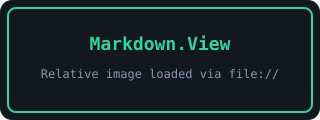
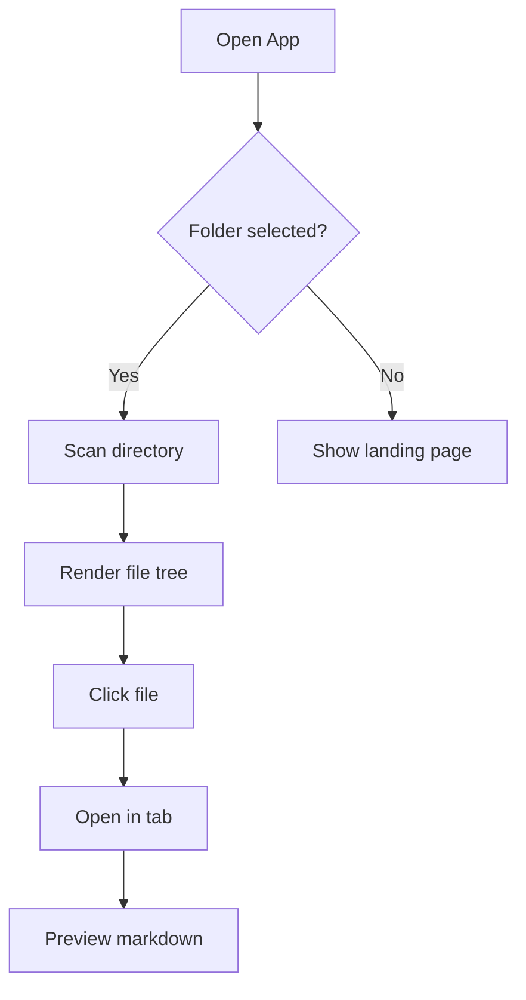
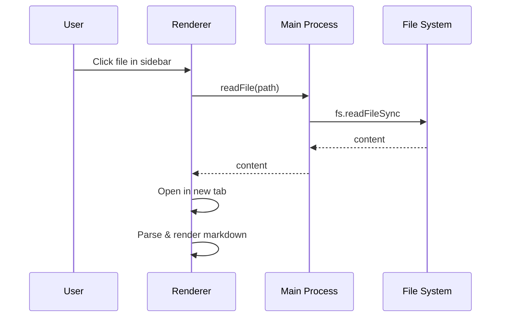
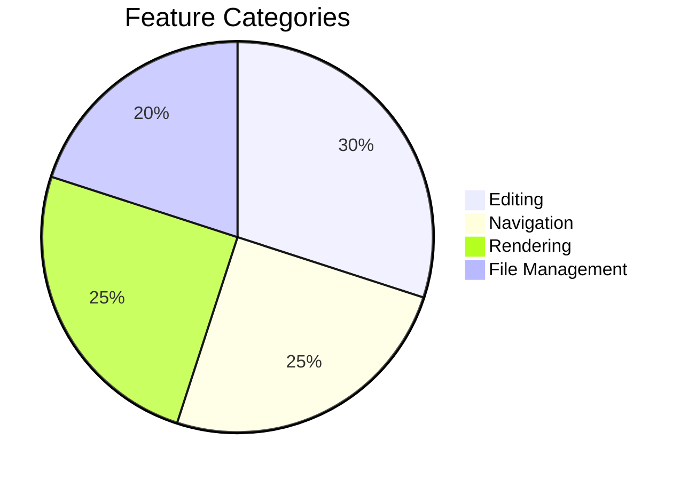

# Markdown.View — Sample File

This file exercises **every feature** of the Markdown.View Electron app. Open it in Preview or Split mode to see everything rendered.

---

## Headings (TOC auto-generates from these)

### Third Level

#### Fourth Level

##### Fifth Level

---

## Text Formatting

**Bold text**, *italic text*, ~~strikethrough~~, and `inline code`.

Here's a <kbd>Ctrl</kbd>+<kbd>S</kbd> keyboard shortcut styled as keys.

> **Blockquote** — this is a standard blockquote with **bold** inside.

> [!NOTE]
> This is a GitHub-style NOTE callout.

> [!TIP]
> This is a TIP callout — useful for hints.

> [!WARNING]
> This is a WARNING callout — be careful!

> [!IMPORTANT]
> This is an IMPORTANT callout.

> [!CAUTION]
> This is a CAUTION callout — danger zone.

---

## Links

- [External link](https://github.com) — opens in default browser
- [Anchor link to Tables section](#tables)
- [Anchor link to Mermaid section](#mermaid-diagrams)

---

## Image Preview (Relative Path)

The image below loads from a relative path (`./sample-img.svg`) — resolved to a `file://` URL automatically:



---

## Code Blocks

### JavaScript

```javascript
function greet(name) {
    const msg = `Hello, ${name}!`;
    console.log(msg);
    return msg;
}
greet('Markdown.View');
```

### C#

```csharp
public class GameEvents
{
    /// <summary> Raised when a tool is picked up. </summary>
    public static event Action<IInventoryItem> OnItemPickedUp;

    public static void RaiseItemPickedUp(IInventoryItem item)
    {
        OnItemPickedUp?.Invoke(item);
    }
}
```

### Python

```python
def fibonacci(n: int) -> list[int]:
    """Generate first n Fibonacci numbers."""
    fib = [0, 1]
    for i in range(2, n):
        fib.append(fib[-1] + fib[-2])
    return fib[:n]

print(fibonacci(10))
```

### JSON

```json
{
    "name": "markdown-viewer-electron",
    "version": "1.0.0",
    "dependencies": {
        "chokidar": "^3.6.0",
        "marked": "^9.1.6",
        "highlight.js": "^11.9.0"
    }
}
```

---

## Tables

| Feature | Shortcut | Status |
|---------|----------|--------|
| Save | `Ctrl+S` | Done |
| Find | `Ctrl+F` | Done |
| Next tab | `Ctrl+Tab` | Done |
| Close tab | `Ctrl+W` | Done |
| Zoom in | `Ctrl+` | Done |
| Zoom out | `Ctrl-` | Done |
| Reset zoom | `Ctrl+0` | Done |

| Left | Center | Right |
|:-----|:------:|------:|
| A | B | C |
| Long text here | Centered | 42 |

---

## Task Lists

- [x] File sidebar with tree hierarchy
- [x] Collapsible folders (Alt+click recursive)
- [x] Right-click context menu
- [x] Multi-file tabs (Ctrl+Tab round-robin)
- [x] Mermaid diagram support
- [x] Relative image resolution
- [x] Find in page (Ctrl+F)
- [x] Page zoom (Ctrl+/-, Ctrl+scroll)
- [ ] Future: Breadcrumb navigation
- [ ] Future: Scroll position memory per tab

---

## Lists

### Unordered

- First item
- Second item
  - Nested item A
  - Nested item B
    - Deep nested
- Third item

### Ordered

1. Step one
2. Step two
3. Step three
   1. Sub-step A
   2. Sub-step B

---

## Math (styled spans)

Inline math: $E = mc^2$

Block math:

$$
\sum_{i=1}^{n} i = \frac{n(n+1)}{2}
$$

---

## Footnotes

This sentence has a footnote[^1] and another one[^2].

[^1]: First footnote — footnotes appear at the bottom.
[^2]: Second footnote — with a [link](https://example.com) inside.

---

## Mermaid Diagrams

### Flowchart (with tooltips — hover nodes!)



### Sequence Diagram



### Pie Chart



---

## Horizontal Rules

The lines above and below are horizontal rules (`---`).

---

## Definition List

Electron
: A framework for building desktop apps with web technologies.

Chokidar
: A file watching library for Node.js.

Mermaid
: A diagramming library that renders text definitions into SVG diagrams.

---

## Abbreviation

The HTML specification is maintained by the W3C.

*[HTML]: Hyper Text Markup Language
*[W3C]: World Wide Web Consortium

---

> **End of sample.** Try editing this file in Raw mode — changes auto-save after 3 seconds. Switch between tabs with Ctrl+Tab. Use Ctrl+F to search. Zoom with Ctrl+/- or Ctrl+scroll wheel.
